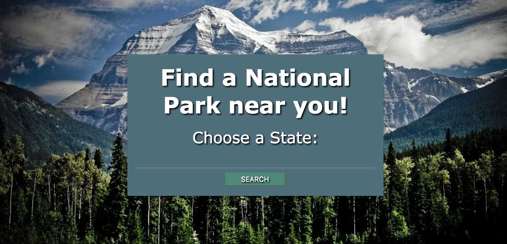
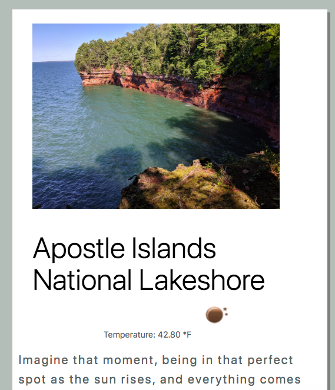
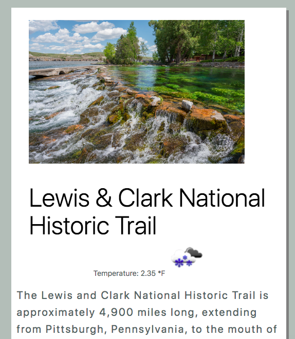
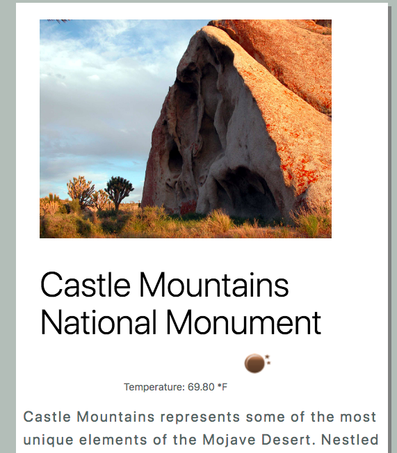
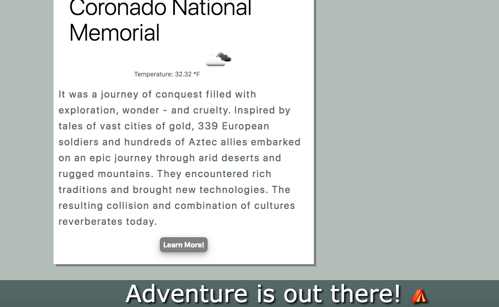

## Park Project
# Find a National Park near you!

A collaborative project between Rache Reidenga, Sophia Mazurek and Joshua Austin to create a helpful application for users to find National Parks in the United States.

## Build Status

The National Parks application is still in its early stages of development. Currently the application allows a user to search any state by typing in the states abbreviation, the user is then presented with the name of the parks within that state along with a photo, brief description, the current weather and a link to bring the user directly to the National Parks site.

In the future we hope to expand on the information to contain facilities, camping, hiking and other activities that each park offers. All available activities would be displayed with an emoji so that the user would know exactly what each park has to offer with a quick glance.

## Technologies

* HTML
* CSS
* JavaScript
* Materialize CSS
* OpenWeather API
* National Parks Service API

## Deployment

Link to [National Parks](https://rachel-reidenga.github.io/ParkProject/)

Link to code on [GitHub](https://github.com/Rachel-Reidenga/ParkProject/blob/main/assets/js/script.js)

Link to repository on [GitHub](https://github.com/Rachel-Reidenga/ParkProject)

## Screenshots

## Built With

Shout out to Tanetta J, Monica H and Paul C

## Acknowledgments

[css-tricks.com](https://css-tricks.com/)

[w3schools.com](https://www.w3schools.com/)

[stackoverflow](https://stackoverflow.com/)

[National Parks Service](https://www.nps.gov/subjects/digital/nps-data-api.htm)

[OpenWeather](https://openweathermap.org/api)

[Materialize](https://materializecss.com/)
